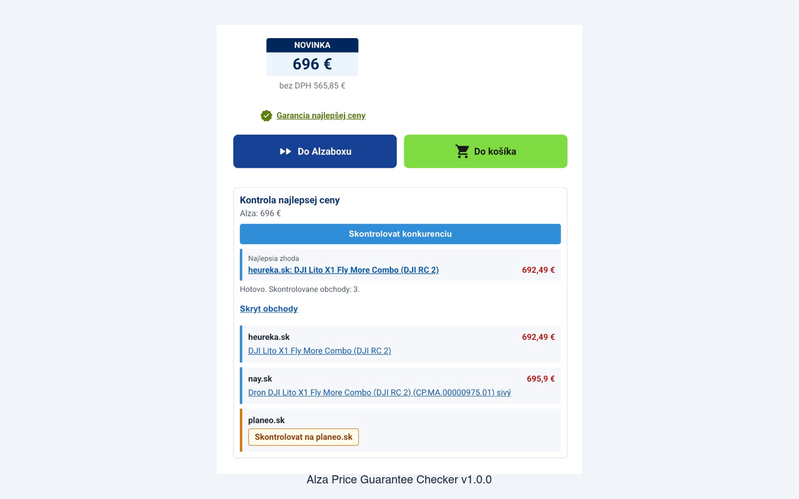

# Alza Price Guarantee Checker

Chrome extension that compares Alza.sk prices against competitor shops listed in their "Garancia najlepšej ceny" program. Also blocks ads, shows unit prices, and strips tracking scripts on Alza and Heureka.



## Features

- **Price comparison** — searches 20+ Slovak e-shops (heureka, drmax, nay, decathlon, alltoys, etc.) and extracts the best matching price
- **Two-step verification** — fetches competitor detail pages for accurate pricing via JSON-LD, OpenGraph meta tags, and DOM extraction
- **Unit price** — shows price per kg/liter on listing and detail pages; price per piece for LEGO sets
- **Ad blocking** — `declarativeNetRequest` rules kill Google Ads, Criteo, Facebook, Hotjar, Clarity, and 10 other tracking domains before they load
- **UI cleanup** — hides instalment pricing, warranty upsells, delivery promos, branding banners, and footer clutter on Alza; hides ads on Heureka
- **Copy product name** — one-click clipboard copy from the product title

## Install

### From GitHub Release (recommended)

1. Download the latest `.zip` from [Releases](https://github.com/martin-gomola/alza-price-guarantee-checker/releases)
2. Extract the zip to a folder
3. Open `chrome://extensions`
4. Enable **Developer mode** (top-right toggle)
5. Click **Load unpacked**, select the extracted folder
6. Visit any Alza.sk product page

### From source

1. Clone this repo
2. Open `chrome://extensions`
3. Enable **Developer mode**
4. Click **Load unpacked**, select the repo folder
5. Visit any Alza.sk product page

The comparison panel appears below the buy button. Click **Skontrolovať konkurenciu** to run.

## Settings

Click the extension icon to toggle:

| Toggle | Default | What it does |
|--------|---------|--------------|
| Čistenie UI | on | Hides Alza clutter (splátky, warranties, banners) |
| Jednotková cena | on | Shows €/kg, €/l, ct/ks where applicable |
| Overenie cien z detailu | on | Fetches competitor detail pages for precise prices |
| Heureka: skryť reklamy | on | Hides banner ads on heureka.sk |

## How it works

1. Reads the product name and price from the Alza page
2. Detects supported shops from Alza's price guarantee dialog or API
3. Searches each shop (heureka first, then alphabetical)
4. Parses results: JSON-LD structured data > meta tags > DOM heuristics > full-text regex
5. Optionally fetches the detail page for price verification
6. Displays results with direct links

## Verify

```sh
npm test
```
